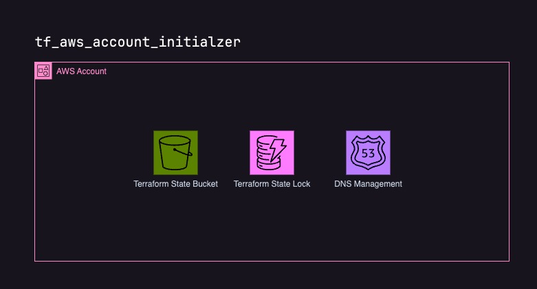

# tf_aws_account_initializer
The GitHub repository `tf_aws_account_initializer` contains Terraform scripts to initialize an AWS account to use with Terraform with the following resources:

| Resource | Description |
| -------- | ----------- |
| S3 Bucket | For storing Terraform state. |
| DynamoDB Table | For state locking to prevent simultaneous updates. |
| Route 53 Hosted Zone | For DNS management. |

This Terraform is intended to run once with no state.

## Security considerations
This Terraform was validated using [Trivy](https://aquasecurity.github.io/trivy/v0.52/). You'll find the report in [SECURITY](./SECURITY). 

- It is intended not to use customer managed encryption keys.
- Bucket logging is disabled.
- Point-in-time recovery is not enabled since it's just a terraform state which can be changed by terraform itself.

## Requirements

| Name | Version |
|------|---------|
|  [aws](#requirement\_aws) | ~> 5 |

## Providers

| Name | Version |
|------|---------|
|  [aws](#provider\_aws) | 5.55.0 |

## Modules

No modules.

## Resources

| Name | Type |
|------|------|
| [aws_dynamodb_table.state_lock](https://registry.terraform.io/providers/hashicorp/aws/latest/docs/resources/dynamodb_table) | resource |
| [aws_route53_zone.zone](https://registry.terraform.io/providers/hashicorp/aws/latest/docs/resources/route53_zone) | resource |
| [aws_s3_bucket.state_bucket](https://registry.terraform.io/providers/hashicorp/aws/latest/docs/resources/s3_bucket) | resource |
| [aws_s3_bucket_public_access_block.publicBlock](https://registry.terraform.io/providers/hashicorp/aws/latest/docs/resources/s3_bucket_public_access_block) | resource |
| [aws_s3_bucket_server_side_encryption_configuration.encryption](https://registry.terraform.io/providers/hashicorp/aws/latest/docs/resources/s3_bucket_server_side_encryption_configuration) | resource |
| [aws_s3_bucket_versioning.versioning](https://registry.terraform.io/providers/hashicorp/aws/latest/docs/resources/s3_bucket_versioning) | resource |

## Inputs

| Name | Description | Type | Default | Required |
|------|-------------|------|---------|:--------:|
|  [assume\_role\_arn](#input\_assume\_role\_arn) | The ARN of the role to assume | `string` | `null` | no |
|  [aws\_default\_tags](#input\_aws\_default\_tags) | The default tags to apply to all resources | `map(string)` | `{}` | no |
|  [aws\_profile](#input\_aws\_profile) | The AWS profile to use | `string` | `"default"` | no |
|  [aws\_region](#input\_aws\_region) | The AWS region to deploy resources | `string` | `"eu-central-1"` | no |
|  [fqdn](#input\_fqdn) | The FQDN of the Route 53 zone | `string` | n/a | yes |
|  [reverse\_fqdn](#input\_reverse\_fqdn) | The reverse FQDN of the Route 53 zone | `string` | n/a | yes |

## Outputs

| Name | Description |
|------|-------------|
|  [name\_servers](#output\_name\_servers) | The name servers of the hosted zone |
|  [route53\_hosted\_zone\_id](#output\_route53\_hosted\_zone\_id) | The ID of the hosted zone |
|  [state\_bucket](#output\_state\_bucket) | The name of the state bucket |
|  [state\_lock\_table](#output\_state\_lock\_table) | The name of the state lock table |
